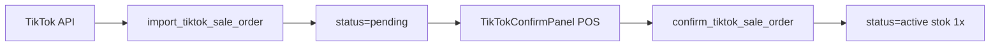
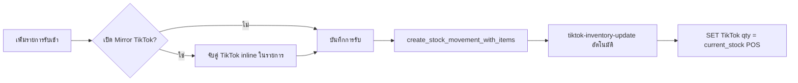
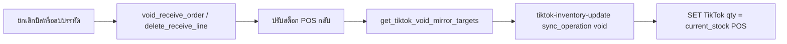
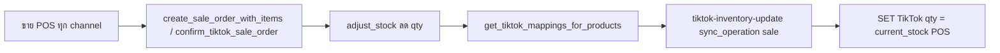

# TikTok Shop Integration — Setup Runbook

## Phase 0 — Partner Center (ทำด้วยมือ)

1. **Rotate App Secret** ใน [TikTok Partner Center](https://partner.tiktokshop.com) (secret เคยถูกแชร์ในแชท)
2. ตั้ง **Redirect URL**:
   ```
   https://zrymhhkqdcttqsdczfcr.supabase.co/functions/v1/tiktok-auth
   ```
3. ตั้ง **Webhook URL** (หลัง deploy functions):
   ```
   https://zrymhhkqdcttqsdczfcr.supabase.co/functions/v1/tiktok-webhook
   ```
   Events: `ORDER_STATUS_CHANGE`, `RECIPIENT_ADDRESS_UPDATE`, `PACKAGE_UPDATE`, `Order return status` (type 12)
4. เปิด scopes (ทั้งหมดที่ใช้):
   - **Order Information** (read)
   - **Finance** (read) — net received / settlement
   - **Fulfillment** (read + write) — label, packing slip, ship/RTS
   - **Logistics** (read) — shipping providers
   - **Product** (read + **write**) — catalog/รูป SKU + จับคู่สินค้า + **mirror สต็อกหลังรับเข้า**
   - **Return & Refund** (read) — คืนเงิน/คืนสินค้า
   - **Authorization**
5. รอ category **การจัดการกลยุทธ์การขาย → ตัวเชื่อมต่อ** อนุมัติ (~3-5 วัน)
6. **หลังเพิ่ม scope Fulfillment หรือ Product write** — admin ต้อง **เชื่อมต่อใหม่** ใน POS (ตั้งค่า → TikTok Shop → เชื่อมต่อ)

## Supabase Secrets

ตั้งใน Dashboard → Edge Functions → Secrets:

| Secret | ค่า |
|--------|-----|
| `TIKTOK_APP_KEY` | App Key จาก Partner Center |
| `TIKTOK_APP_SECRET` | App Secret (หลัง rotate) |
| `TIKTOK_WEBHOOK_SECRET` | Webhook secret จาก Partner Center |
| `TIKTOK_POS_REDIRECT_URL` | `https://evasi0m.github.io/TIMES_POS/?tiktok=connected` |

`SUPABASE_URL` และ `SUPABASE_SERVICE_ROLE_KEY` มีอยู่แล้วใน Edge runtime

## Apply Migrations

รันใน SQL Editor ตามลำดับ:

1. `supabase-migrations/032_tiktok_integration.sql`
2. `supabase-migrations/033_tiktok_cron.sql`
3. `supabase-migrations/034_tiktok_fulfillment_fields.sql`
4. `supabase-migrations/035_tiktok_returns.sql` — ตาราง returns + ใบลดหนี้
5. `supabase-migrations/036_tiktok_settlement_breakdown.sql` — fee breakdown
6. `supabase-migrations/037_tiktok_product_matching.sql` — จับคู่สินค้า + re-link stock
7. `supabase-migrations/038_tiktok_returns_cron.sql` — cron returns
8. `supabase-migrations/039_tiktok_exclude_from_pos_pending.sql` — API TikTok ไม่เข้า PendingNetBell
9. `supabase-migrations/040_tiktok_pending_confirmation.sql` — **pending → confirm ที่ POS**
10. `supabase-migrations/041_tiktok_restore_pre_golive_orders.sql` — repair (เฉพาะถ้า 040 รันก่อน cutoff)
11. `supabase-migrations/042_tiktok_void_legacy_pre_golive.sql` — void duplicate pre go-live
12. `supabase-migrations/043_tiktok_poll_cron_5min.sql` — poll ทุก 5 นาที
13. `supabase-migrations/044_tiktok_pending_golive_runtime.sql` — cutoff runtime + cleanup
14. `supabase-migrations/045_tiktok_product_image_sync.sql` — sync รูป SKU → product_images
15. `supabase-migrations/046_tiktok_matching_super_admin.sql` — matching เฉพาะ super_admin
16. `supabase-migrations/047_tiktok_confirm_defer_net.sql` — ใส่ทีหลัง net ตอนยืนยัน + backfill bell queue
17. `supabase-migrations/048_tiktok_inventory_sync.sql` — **mirror สต็อก POS → TikTok หลังรับเข้า** (opt-in, audit log, idempotency)
18. `supabase-migrations/049_tiktok_void_mirror.sql` — void / ลบบรรทัดรับเข้า → mirror สต็อกกลับ TikTok
19. `supabase-migrations/051_tiktok_resync_pending_items.sql` — re-sync line items/total ของออเดอร์ **pending** เมื่อลูกค้าแก้ออเดอร์บน TikTok (active/voided ไม่แตะ)
20. `supabase-migrations/052_tiktok_inventory_sync_service_role.sql` — ให้ Edge Function บันทึก `tiktok_inventory_sync_log` ได้ (แก้ void mirror ไม่ทำงานหลัง receive สำเร็จ)
21. `supabase-migrations/050_tiktok_health_rpc.sql` — `get_tiktok_health()` สำหรับ health card ใน ตั้งค่า → TikTok Shop
22. `supabase-migrations/053_tiktok_receipt_sku_name.sql` — ใบเสร็จออเดอร์ TikTok แสดง **ชื่อ SKU ที่จับคู่** (ไม่ใช่ชื่อตะกร้า/ชื่อ TikTok); แก้ confirm/link/relink ให้ snapshot `product_name` จากสินค้า POS + backfill ออเดอร์เก่า

**Go-live cutoff:** 13:00 07/06/2026 Asia/Bangkok — ออเดอร์หลัง cutoff เข้า `pending`; ก่อน cutoff → `voided`

**Vault (จำเป็นสำหรับ cron):**
```sql
SELECT vault.create_secret('<SERVICE_ROLE_JWT>', 'service_role_key');
```

หรือใช้ `supabase db push` (ต้อง link project ก่อน)

ดูรายงาน audit ล่าสุด: [TIKTOK_PRODUCTION_AUDIT.md](./TIKTOK_PRODUCTION_AUDIT.md)  
คู่มือแคชเชียร์: [TIKTOK_CASHIER_BRIEF.md](./TIKTOK_CASHIER_BRIEF.md)

## Deploy Edge Functions

```bash
supabase login
supabase link --project-ref zrymhhkqdcttqsdczfcr

supabase functions deploy tiktok-auth --no-verify-jwt
supabase functions deploy tiktok-connect
supabase functions deploy tiktok-token-refresh
supabase functions deploy tiktok-webhook --no-verify-jwt
supabase functions deploy tiktok-order-import
supabase functions deploy tiktok-settlement-sync
supabase functions deploy tiktok-poll-orders
supabase functions deploy tiktok-shipping-label
supabase functions deploy tiktok-ship-package
supabase functions deploy tiktok-returns-sync
supabase functions deploy tiktok-invoice-submit --no-verify-jwt
supabase functions deploy tiktok-products-search
supabase functions deploy tiktok-inventory-update
```

## เชื่อมต่อร้าน

1. Login เป็น admin ใน TIMES POS
2. ตั้งค่า → แท็บ **TikTok Shop** → กด "เชื่อมต่อ TikTok Shop"
3. อนุมัติใน TikTok → redirect กลับ POS

## Workflow ยืนยันออเดอร์ที่ POS (040+)



- Import **ไม่ตัดสต็อก** — รอ kasir ยืนยัน
- Kasir จับคู่ SKU แล้ว **ใส่ `net_received` หรือกด "ใส่ทีหลัง"** → confirm
- ถ้าเลือก "ใส่ทีหลัง" → order เข้า **PendingNetBell** (รอใส่ราคาที่ร้านได้รับ) จนกว่าจะกรอก net หรือ settlement cron อัปเดต
- หลัง confirm เท่านั้นเข้า Sales History / Dashboard / VAT
- Manual POS channel=tiktok **แยกจาก API** — มี guard เตือนถ้าซ้ำกับ pending API

## Cron Jobs (หลัง migration 033 + 043)

| Job | ความถี่ | Function |
|-----|---------|----------|
| `tiktok-token-refresh` | ทุก 12 ชม. | refresh access token |
| `tiktok-settlement-sync` | ทุกวัน 03:00 UTC | อัปเดต net_received + fee breakdown |
| `tiktok-poll-orders` | ทุก 5 นาที | import orders (pagination, create+update time) |
| `tiktok-returns-sync` | ทุก 6 ชม. (xx:15) | sync คืนเงิน/คืนสินค้า (หลัง migration 038) |

## ฟีเจอร์ Fulfillment (E-Commerce → TikTok)

### ดูสินค้า + รูป SKU
- Sync / อัปเดตข้อมูล TikTok ดึง `product_name`, `sku_name`, `seller_sku`, `sku_image` จาก Order Detail API
- แสดงใน TikTokPanel พร้อมที่อยู่จัดส่ง

### ปริ้น Label ขนส่ง (TikTok official)
- ปุ่ม **ปริ้น label** เรียก Edge Function `tiktok-shipping-label`
- API: `GET /fulfillment/202309/packages/{package_id}/shipping_documents` (`document_type=SHIPPING_LABEL`, `document_size=A6`)
- `doc_url` หมดอายุ 24 ชม. — fetch ใหม่ทุกครั้งก่อนพิมพ์
- ออเดอร์ `tiktok_shipping_type = SELLER` ไม่มี official label
- ถ้ายังไม่มี package — arrange shipment ใน TikTok Seller Center ก่อน หรือใช้ Ship Package API

### เตรียมจัดส่ง / Ship (RTS)
- ปุ่ม **เตรียมจัดส่ง** เรียก `tiktok-ship-package` → `POST /fulfillment/202309/packages/ship`
- TikTok Shipping: handover `DROP_OFF`/`PICKUP`; Seller self-ship: ส่ง `self_shipment{provider_id, tracking}`
- หลัง ship แล้วจะดึง `tracking_number` กลับมาเก็บใน `sale_orders`
- เมื่อมี package → ปริ้น label / packing slip ได้

### packing slip
- ปุ่ม **packing slip** ใช้ `document_type=PACKING_SLIP` ผ่าน edge เดียวกับ label

### ใบกำกับเต็มรูป (ม.86/4)
- Import auto-fill `buyer_name` + `buyer_address` จากที่อยู่จัดส่ง TikTok
- Admin เติม **Tax ID** ใน panel ก่อนออกใบ
- Bulk print A4 / Export CSV จาก TikTokPanel

### คืนเงิน / คืนสินค้า (Return & Refund)
- แท็บ **คืนเงิน/คืนสินค้า** → "ดึงรายการคืน" เรียก `tiktok-returns-sync`
- ปุ่ม **ออกใบลดหนี้** → `create_tiktok_credit_note` สร้าง `return_orders` + ใบลดหนี้ (ม.86/10)
- `RETURN_AND_REFUND` คืน stock; `REFUND` อย่างเดียวไม่คืน stock

### net received / ค่าธรรมเนียม
- **Workflow ใหม่ (040+):** kasir ใส่ `net_received` ตอนยืนยัน หรือกด **"ใส่ทีหลัง"** แล้วกรอกทีหลังผ่านปุ่มกระดิ่ง (047)
- Cron `tiktok-settlement-sync` (03:00 UTC) อาจเติม net อัตโนมัติเมื่อ `net_received_pending = true`
- ออเดอร์ที่ยืนยันแล้วแต่ยังไม่มี net → แสดงใน **PendingNetBell** (รอใส่ราคาที่ร้านได้รับ)

### Mirror สต็อกหลังรับเข้า (048)



- ใช้ได้ทั้ง **รับเข้า manual** และ **รับเข้า ×10** (bulk)
- **จับคู่ TikTok ก่อนบันทึก** — แต่ละบรรทัดในรายการรับเข้า (ไม่มี modal หลังบันทึก)
- **Opt-in** — checkbox "Mirror สต็อกไป TikTok Shop"; แต่ละบรรทัดเลือก **ไม่ sync** ได้
- บันทึกไม่ได้จนกว่าทุกบรรทัด (ที่ไม่ skip) จะจับคู่ TikTok แล้ว
- หลังบันทึกสำเร็จ → mirror อัตโนมัติ + toast สรุป (ไม่เปิด panel)
- **Mirror** = ตั้ง TikTok ให้เท่า `current_stock` POS หลังรับเข้า (ไม่ใช่บวก delta)
  - ตัวอย่าง: POS 10 + TikTok 9 รับเข้า 5 → ทั้งคู่เป็น **15** (ไม่ใช่ 14)
- Preview ก่อนบันทึก: `current_stock + quantity` · หลังบันทึกใช้สต็อกจริงจาก DB
- Mapping เดิมใน `tiktok_product_mappings` → auto-fill ในรายการ (manual, ×10, Order TikTok ใช้ตารางเดียวกัน)
- **×10 บันทึก mapping** — สินค้าที่มี `product.id` แล้ว: upsert ทันทีเมื่อเลือก SKU ใน review; สินค้าใหม่ (`status === 'new'`): upsert ตอนบันทึกบิล ก่อน mirror
- หลัง persist ทันที → `refreshMappings` → แถวอื่นในบิลเดียวกัน/บิลอื่นใน batch auto-fill
- TikTok sync ล้มเหลว **ไม่ rollback** รับเข้า POS
- Idempotency: `tiktok_inventory_sync_log` UNIQUE `(receive_order_id, product_id, sync_operation) WHERE status='success'`
- ต้องมี scope **Product write** + migration 048 + deploy `tiktok-products-search` / `tiktok-inventory-update`

### Mirror สต็อกหลังยกเลิกบิล / ลบบรรทัด (049)



- ทำงานอัตโนมัติหลัง **ยกเลิกทั้งบิล** (admin) หรือ **ลบทีละบรรทัด** (super admin)
- Mirror เฉพาะสินค้าที่เคย mirror สำเร็จตอนรับเข้า (`sync_operation='receive'` + `status='success'`)
- ไม่ขึ้นกับ checkbox Mirror ปัจจุบัน — ถ้าเคย sync สำเร็จตอนรับเข้า ยกเลิกแล้วต้อง sync กลับ
- ตัวอย่าง: POS 5 รับเข้า 3 mirror สำเร็จ → POS/TikTok 8 · ยกเลิกบิล → POS/TikTok **5**
- ลบ 1 บรรทัดจากบิลหลาย SKU → sync เฉพาะ SKU นั้น
- TikTok sync ล้มเหลว **ไม่ rollback** การยกเลิก POS
- ต้องรัน migration **049** + redeploy `tiktok-inventory-update`

### Mirror สต็อกหลังขายทุกช่องทาง (055)



- ทำงานหลัง **checkout POS** (หน้าร้าน / Shopee / Lazada / Facebook / TikTok manual), **ยืนยัน TikTok API**, **คิวออฟไลน์ drain**
- เฉพาะสินค้าที่มี mapping ใน `tiktok_product_mappings` + `sync_enabled` + TikTok เชื่อมต่อ
- **Mirror** = ตั้ง TikTok ให้เท่า `current_stock` POS หลังขาย (ไม่ใช่ลด delta)
- ตัวอย่าง: POS 1, TikTok 1, ขาย Shopee ×1 → POS/TikTok **0**
- TikTok sync ล้มเหลว **ไม่ rollback** บิล POS (non-blocking + toast)
- **ยกเลิกบิล** → `sync_operation sale_void` (เฉพาะ SKU ที่เคย mirror `sale` สำเร็จในบิลนั้น)
- **แก้ไข qty บิล** → `sync_operation sale_edit` (re-sync SKU ที่เปลี่ยน)
- Idempotency: `(receive_order_id=sale_order_id, product_id, sync_operation)` — `sale_edit` ยกเว้น (แก้บิลซ้ำได้)
- ต้องรัน migration **055** + redeploy `tiktok-inventory-update`

### จับคู่สินค้า (Product Matching) — super_admin เท่านั้น (046)
- แท็บ **จับคู่สินค้า** แสดงรายการที่ยังไม่ match (`get_tiktok_unmatched_items`)
- เลือกสินค้า POS (ค้นชื่อ/บาร์โค้ด) → `link_tiktok_item_to_product` (มี option ตัด stock ย้อนหลัง)
- ปุ่ม **จับคู่อัตโนมัติใหม่** → `relink_tiktok_by_mapping` ใช้ mapping เดิมกับทุกรายการที่ค้าง

## Troubleshooting

| ปัญหา | แก้ |
|-------|-----|
| `Failed to send a request to the Edge Function` | function ยังไม่ deploy — รัน `supabase functions deploy …` |
| Label API 403 / scope error | เพิ่ม Fulfillment scope + re-authorize ร้านใน POS |
| ไม่มี package_id | กด "เตรียมจัดส่ง" (RTS) ก่อน หรือ ship ใน Seller Center |
| รูป SKU / seller_sku ว่าง | รัน migration 034 แล้วกด "อัปเดตข้อมูล TikTok" (resync) |
| ออเดอร์ "ที่จะจัดส่ง" ไม่ขึ้น | pagination + sync ตาม update_time แล้ว; กด "ดึงรายตัว" ใส่ Order ID เพื่อ debug |
| ใบลดหนี้ออกไม่ได้ | TikTok return ต้องผูกกับออเดอร์ POS (sale_order_id) ก่อน |
| แคชเชียร์ key-in manual ซ้ำกับ API pending | ใช้ badge "Order TikTok รอยืนยัน" — POS จะเตือนก่อน checkout |
| Telegram ยอดไม่ตรง app | redeploy `daily-telegram-summary` + `telegram-send` หลังอัปเดต filter |
| Cron TikTok ไม่ทำงาน | ตั้ง `vault.create_secret(..., 'service_role_key')` |
| Mirror สต็อก TikTok 403 / ไม่พบ warehouse | เพิ่ม Product **write** scope + re-authorize; รัน migration 048 |
| บันทึกรับเข้าไม่ได้เพราะ TikTok | จับคู่ TikTok ในแต่ละบรรทัด หรือติ๊ก "ไม่ sync" |
| Mirror ไม่ทำงานหลังบันทึก | เช็ค checkbox Mirror + TikTok เชื่อมต่อ + Product write scope |
| ยกเลิกบิลแล้ว TikTok ไม่ลด | รัน migration 049 + redeploy `tiktok-inventory-update`; ต้องเคย mirror สำเร็จตอนรับเข้า |
| ขาย Shopee/Lazada แล้ว TikTok ไม่ลด | รัน migration 055; ต้องจับคู่ mapping + TikTok เชื่อมต่อ; ดู toast TikTok sale mirror |
| ยกเลิกบิลขายแล้ว TikTok ไม่คืน | ต้องเคย mirror `sale` สำเร็จในบิลนั้นก่อน (sale_void) |
