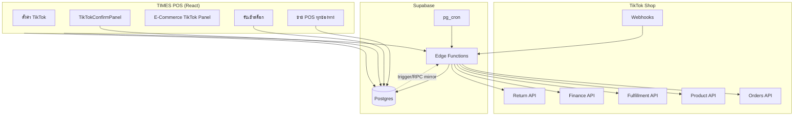
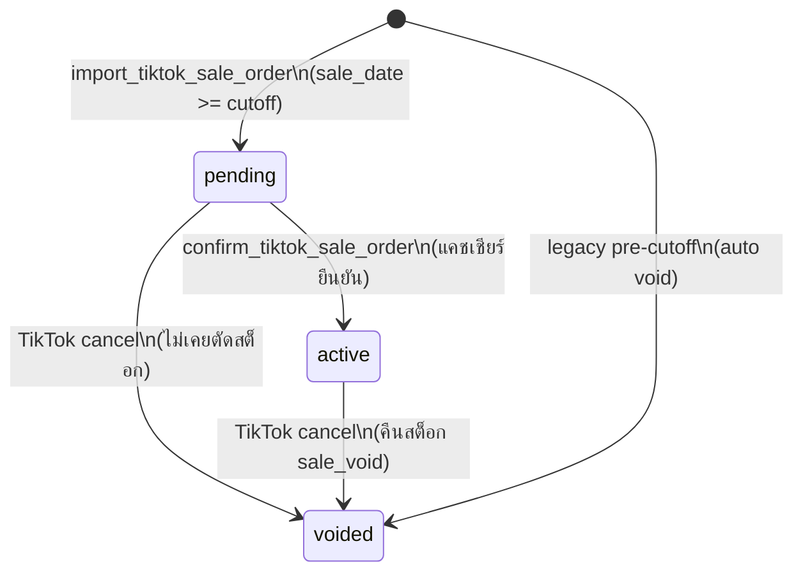

# TikTok Shop API → TIMES POS — เอกสารอ้างอิงครบวงจร

> **จุดประสงค์:** สรุปว่า API TikTok Shop ถูกดึงมาใช้ทำอะไรกับ POS บ้าง — ใช้เป็น blueprint ตอนทำ **Shopee API** และ **Lazada API** ต่อ  
> **อัปเดต:** มิ.ย. 2026 · อ้างอิง migrations 032–068 และ Edge Functions ปัจจุบัน  
> **Runbook deploy:** [TIKTOK_INTEGRATION.md](./TIKTOK_INTEGRATION.md) · **แคชเชียร์:** [TIKTOK_CASHIER_BRIEF.md](./TIKTOK_CASHIER_BRIEF.md)

---

## สารบัญ

1. [ภาพรวม](#1-ภาพรวม)
2. [สถาปัตยกรรม](#2-สถาปัตยกรรม)
3. [การเชื่อมต่อ OAuth](#3-การเชื่อมต่อ-oauth)
4. [API Scopes และ Endpoints ที่ใช้จริง](#4-api-scopes-และ-endpoints-ที่ใช้จริง)
5. [โมเดลข้อมูล (Database)](#5-โมเดลข้อมูล-database)
6. [ออเดอร์ — จาก API ถึงบิล POS](#6-ออเดอร์--จาก-api-ถึงบิล-pos)
7. [จับคู่สินค้า (Product Matching)](#7-จับคู่สินค้า-product-matching)
8. [Mirror สต็อก POS ↔ TikTok](#8-mirror-สต็อก-pos--tiktok)
9. [Fulfillment — จัดส่ง / Label](#9-fulfillment--จัดส่ง--label)
10. [การเงิน — net received / ค่าธรรมเนียม](#10-การเงิน--net-received--ค่าธรรมเนียม)
11. [คืนเงิน / คืนสินค้า](#11-คืนเงิน--คืนสินค้า)
12. [ใบกำกับภาษี (ม.86/4)](#12-ใบกำกับภาษี-ม864)
13. [Webhook และ Cron](#13-webhook-และ-cron)
14. [Edge Functions ทั้งหมด](#14-edge-functions-ทั้งหมด)
15. [หน้าจอ UI ใน POS](#15-หน้าจอ-ui-ใน-pos)
16. [กฎสำคัญและ Guard Rails](#16-กฎสำคัญและ-guard-rails)
17. [Checklist สำหรับ Shopee / Lazada](#17-checklist-สำหรับ-shopee--lazada)

---

## 1. ภาพรวม

TIMES POS เชื่อม TikTok Shop ผ่าน **TikTok Open API (202309)** โดย Edge Functions บน Supabase เป็นตัวกลาง — client (React) **ไม่ถือ access token** โดยตรง

**สิ่งที่ API ทำกับ POS (สรุปสั้น):**

| หมวด | ทิศทาง | สิ่งที่เกิดขึ้น |
|------|--------|----------------|
| **ออเดอร์** | TikTok → POS | ดึงออเดอร์ → สร้าง `sale_orders` สถานะ `pending` → แคชเชียร์ยืนยัน → `active` + ตัดสต็อก |
| **สถานะออเดอร์** | TikTok → POS | อัปเดต `tiktok_order_status`, ที่อยู่, package, tracking; ยกเลิก → `voided` |
| **จับคู่ SKU** | สองทาง | mapping `tiktok_sku_id ↔ product_id` — auto-match ตอน import + manual ที่ POS |
| **สต็อก** | POS → TikTok | **Mirror** = ตั้ง qty TikTok ให้ **เท่า** `current_stock` POS (ไม่ใช่บวก delta) |
| **Fulfillment** | POS → TikTok | พิมพ์ label, packing slip, RTS (Ready to Ship) |
| **การเงิน** | TikTok → POS | ดึง settlement → อัปเดต `net_received` + fee breakdown |
| **คืนสินค้า** | TikTok → POS | sync return → ออกใบลดหนี้ + mirror สต็อก (ถ้า RETURN_AND_REFUND) |
| **ใบกำกับ** | POS (ออกเอง) | ลูกค้ากรอก Tax ID ผ่านลิงก์ token → ออกใบกำกับเต็มรูป |

**หลักการสำคัญ:**

- **POS เป็น source of truth สำหรับสต็อก** — TikTok ถูก mirror ตาม POS
- **Import ออเดอร์ไม่ตัดสต็อก** — รอแคชเชียร์ยืนยันที่ POS
- **TikTok sync ล้มเหลวไม่ rollback POS** — non-blocking + toast + audit log
- **Manual checkout channel=tiktok แยกจาก API** — มี guard กันซ้ำ

---

## 2. สถาปัตยกรรม



**ไฟล์หลักใน repo:**

| ชั้น | ไฟล์ |
|------|------|
| API client | `supabase/functions/_shared/tiktok-client.ts` |
| Import logic | `supabase/functions/_shared/tiktok-order-import.ts` |
| Client mirror | `src/lib/tiktok-inventory-sync.js` |
| UI ออเดอร์ | `src/components/ecommerce/TikTokPanel.jsx` |
| UI ยืนยัน | `src/components/pos/TikTokConfirmPanel.jsx` |
| Channel rules | `src/lib/ecommerce-channels.js` |

---

## 3. การเชื่อมต่อ OAuth

### Flow

1. Admin → **ตั้งค่า → TikTok Shop** → กด "เชื่อมต่อ"
2. `tiktok-connect` สร้าง `oauth_state` ใน `tiktok_tokens` แล้ว redirect ไป TikTok authorize
3. TikTok redirect กลับ `tiktok-auth` พร้อม `code`
4. `tiktok-auth` แลก code → เก็บ `access_token`, `refresh_token`, `shop_cipher`, `shop_id`, `shop_name`
5. Redirect กลับ POS (`TIKTOK_POS_REDIRECT_URL`)

### Token refresh

- Cron `tiktok-token-refresh` ทุก **12 ชม.**
- `getValidAccessToken()` ใน client จะ refresh อัตโนมัติถ้าใกล้หมดอายุ (buffer 5 นาที)
- **ต้อง re-authorize** หลังเพิ่ม scope ใหม่ (เช่น Product write, Fulfillment)

### ตาราง `tiktok_tokens`

Singleton row `id=1` — client อ่านผ่าน RPC `get_tiktok_connection_status()` เท่านั้น (ไม่ expose token)

### Secrets (Supabase Edge)

| Secret | ใช้ทำอะไร |
|--------|-----------|
| `TIKTOK_APP_KEY` | App Key |
| `TIKTOK_APP_SECRET` | HMAC sign request |
| `TIKTOK_WEBHOOK_SECRET` | Verify webhook signature |
| `TIKTOK_POS_REDIRECT_URL` | Redirect หลัง OAuth สำเร็จ |

---

## 4. API Scopes และ Endpoints ที่ใช้จริง

### Scopes ใน Partner Center

| Scope | ใช้กับฟีเจอร์ POS |
|-------|------------------|
| **Order Information (read)** | Import/poll ออเดอร์, อัปเดตสถานะ |
| **Finance (read)** | Settlement → `net_received`, fee breakdown |
| **Fulfillment (read+write)** | Label, packing slip, ship/RTS |
| **Logistics (read)** | รายชื่อ warehouse |
| **Product (read+write)** | ค้นหา catalog, mirror สต็อก, sync รูป |
| **Return & Refund (read)** | Sync คืนเงิน/คืนสินค้า |
| **Authorization** | OAuth |

### Endpoints ที่เรียกจริง

| API Path | ใช้เมื่อ | Edge Function / Module |
|----------|---------|------------------------|
| `GET /order/202309/orders` | ดึงรายละเอียดออเดอร์ 1 รายการ | `tiktok-order-import`, webhook, poll |
| `POST /order/202309/orders/search` | ค้นหาออเดอร์ตามเวลา/สถานะ | `tiktok-poll-orders` |
| `POST /product/202502/products/search` | ค้นหา SKU ใน catalog | `tiktok-products-search` |
| `GET /product/202309/products/{id}` | อ่าน qty, รูป SKU | `tiktok-inventory-update`, image backfill |
| `POST /product/202309/products/{id}/inventory/update` | **Mirror สต็อก** | `tiktok-inventory-update` |
| `GET /logistics/202309/warehouses` | รายชื่อคลัง | `tiktok-inventory-update` |
| `GET /fulfillment/202309/packages/{id}/shipping_documents` | Label / packing slip | `tiktok-shipping-label` |
| `POST /fulfillment/202309/packages/ship` | RTS / ส่งมอบขนส่ง | `tiktok-ship-package` |
| `POST /finance/202309/orders/{id}/statement_transactions` | Settlement รายออเดอร์ | `tiktok-settlement-sync` |
| `POST /finance/202309/orders/settlements` | Settlement fallback | `tiktok-settlement-sync` |
| `POST /return_refund/202309/returns/search` | ค้นหารายการคืน | `tiktok-returns-sync` |

---

## 5. โมเดลข้อมูล (Database)

### ตารางหลัก

| ตาราง | บทบาท |
|-------|--------|
| `tiktok_tokens` | OAuth tokens (singleton) |
| `tiktok_product_mappings` | `tiktok_sku_id` → `product_id` (+ seller_sku, ชื่อ, รูป, warehouse) |
| `tiktok_inventory_sync_log` | Audit mirror ทุก operation + idempotency |
| `tiktok_return_orders` | รายการคืนจาก TikTok |
| `tiktok_invoice_requests` | Token สำหรับฟอร์มใบกำกับ |
| `tiktok_order_events` | Audit lifecycle (cancel, void mirror ฯลฯ) |

### คอลัมน์บน `sale_orders` (TikTok)

| คอลัมน์ | ความหมาย |
|--------|----------|
| `tiktok_order_id` | Order ID จาก TikTok (unique) |
| `tiktok_order_status` | สถานะบนแพลตฟอร์ม (AWAITING_SHIPMENT, CANCELLED ฯลฯ) |
| `tiktok_synced_at` | เวลา sync ล่าสุด |
| `tiktok_payment_method` | ชื่อช่องทางชำระจาก TikTok |
| `tiktok_package_ids` | Package IDs สำหรับ label |
| `tracking_number` | เลข tracking หลัง ship |
| `tiktok_shipping_type` | TIKTOK / SELLER |
| `shipping_*` | ที่อยู่จัดส่ง |
| `buyer_name`, `buyer_address` | สำหรับใบกำกับ |
| `net_received`, `net_received_pending` | เงินที่ร้านได้รับจริง |
| `confirmed_at` | เวลาแคชเชียร์ยืนยัน (go-live workflow) |
| `has_substitution`, `has_edits` | flags สำหรับคอลัมน์สถานะในประวัติขาย (068) |

### คอลัมน์บน `sale_order_items` (TikTok)

| คอลัมน์ | ความหมาย |
|--------|----------|
| `tiktok_sku_id`, `tiktok_line_id` | อ้างอิงบน TikTok |
| `seller_sku`, `sku_name`, `sku_image_url` | ข้อมูลจาก API |
| `product_id` | สินค้า POS ที่จับคู่ |
| `is_substitution` | ส่งจริงคนละรุ่น (062) |

### RPC สำคัญ

| RPC | ใช้เมื่อ |
|-----|---------|
| `import_tiktok_sale_order` | สร้าง/อัปเดตบิลจาก API |
| `confirm_tiktok_sale_order` | แคชเชียร์ยืนยัน → active + ตัดสต็อก |
| `void_tiktok_sale_order` | TikTok cancel → void |
| `link_tiktok_item_to_product` | จับคู่รายการ (admin) |
| `relink_tiktok_by_mapping` | จับคู่อัตโนมัติจาก mapping เดิม |
| `upsert_tiktok_inventory_mapping` | บันทึก mapping ตอนรับเข้า/ยืนยัน |
| `get_tiktok_mappings_for_products` | หา mapping ก่อน mirror ขาย |
| `get_tiktok_void_mirror_targets` | SKU ที่ต้อง mirror หลัง void รับเข้า |
| `get_tiktok_sale_mirror_targets` | SKU ที่ต้อง mirror หลังขาย/void ขาย |
| `reconcile_pos_stock_from_tiktok` | ปรับ POS ให้เท่า TikTok (เช็คสต็อก) |
| `create_tiktok_credit_note` | ออกใบลดหนี้จาก return |
| `get_tiktok_health` | Health card ใน Settings |

---

## 6. ออเดอร์ — จาก API ถึงบิล POS

### 6.1 ช่องทางเข้า (Triggers)

| Trigger | ความถี่ | ทำอะไร |
|---------|---------|--------|
| **Webhook** `tiktok-webhook` | Real-time | ORDER_STATUS_CHANGE, ADDRESS, PACKAGE, CANCEL, RETURN → re-import |
| **Cron** `tiktok-poll-orders` | ทุก 5 นาที | ค้นหาออเดอร์ใหม่ + อัปเดตสถานะ (create_time + update_time) |
| **Manual** ใน TikTok Panel | ตาม demand | "ดึงรายตัว" ใส่ Order ID, "อัปเดตข้อมูล TikTok" |
| **Live sync** ใน UI | ~30s ขณะเปิดหน้า | `useTikTokLiveSync` poll เบาๆ |

### 6.2 สถานะ TikTok → การกระทำ POS

| TikTok Status | การกระทำ |
|---------------|----------|
| `UNPAID` | **ข้าม** — ยังไม่ import |
| `AWAITING_SHIPMENT`, `AWAITING_COLLECTION`, `PARTIALLY_SHIPPING`, `IN_TRANSIT`, `DELIVERED`, `COMPLETED` | **Import / Update** |
| `CANCELLED` | **Void** บิล (`void_tiktok_sale_order`) + mirror `sale_void` ถ้าเคย active |

### 6.3 Go-live workflow (migration 040+)



**Go-live cutoff:** 13:00 07/06/2026 (Asia/Bangkok)  
- หลัง cutoff → `status = pending`  
- ก่อน cutoff → `status = voided` (legacy duplicate กันไม่ให้เข้ารายงาน)

### 6.4 ข้อมูลที่ดึงจาก Order Detail API

- วันที่สั่ง, ยอดรวม, VAT 7%, ช่องทางชำระ (COD / online)
- Line items: `sku_id`, `seller_sku`, `sku_name`, `product_name`, รูป, qty, ราคา
- ที่อยู่จัดส่ง → `shipping_*`, `buyer_*`
- Package IDs, tracking, shipping type

### 6.5 Auto-match product ตอน import

ลำดับความสำคัญ (`matchProduct` ใน `tiktok-order-import.ts`):

1. **`tiktok_product_mappings`** ตาม `tiktok_sku_id`
2. **`products.barcode`** = `seller_sku`
3. **SKU tier match** — `seller_sku` vs `model_code`/`name` (exact / suffix whitelist เท่านั้น, ต้องชนะ runner-up ชัดเจน)
4. **Fuzzy name** — score ≥ 0.92 เท่านั้น

ถ้าไม่ match → `product_id = null` → แคชเชียร์ต้องจับคู่ตอนยืนยัน

### 6.6 Re-sync ออเดอร์ pending (051)

ถ้าลูกค้าแก้ออเดอร์บน TikTok ขณะยัง `pending`:
- `resync_tiktok_pending_order` อัปเดต line items + ยอดรวม
- **ไม่แตะ** ออเดอร์ `active` / `voided`

### 6.7 ยืนยันที่ POS (`TikTokConfirmPanel`)

4 ขั้นตอน:

1. **จับคู่** — เลือกสินค้า POS ต่อบรรทัด
2. **ตรวจสอบ** — ติ๊ก "ส่งจริงคนละรุ่น" (substitution) ถ้า SKU ไม่ตรง
3. **กรอกเงิน** — `net_received` หรือกด **"ใส่ทีหลัง"**
4. **ยืนยัน** — `confirm_tiktok_sale_order`:
   - `status` → `active`
   - ตัดสต็อก POS
   - บันทึก mapping ถาวร
   - mirror สต็อก TikTok (`sync_operation = sale`)
   - เข้า Sales History / Dashboard / VAT **เท่านั้นหลังมี `confirmed_at`**

### 6.8 ยกเลิกก่อนจัดส่ง (067)

- Webhook/poll เจอ `CANCELLED` → `void_tiktok_sale_order`
- บิล **ไม่หาย** — อยู่แท็บ **ยกเลิก** + ค้นหาได้ใน Command Center / ประวัติขาย
- ถ้าเคย `active` → คืนสต็อก POS (`sale_void`) + queue mirror TikTok
- รับคืนจากลูกค้า: ฟอร์มรับคืนรองรับบิล voided — **กัน double-restock** ถ้า void คืนสต็อกแล้ว

---

## 7. จับคู่สินค้า (Product Matching)

### 7.1 ตาราง mapping

`tiktok_product_mappings`:
- Primary key: `tiktok_sku_id`
- เก็บ `product_id`, `seller_sku`, `tiktok_product_name`, `tiktok_product_id`, `warehouse_id`, `image_url`, `sync_enabled`

### 7.2 จุดที่สร้าง/อัปเดต mapping

| จุด | ใครทำ | หมายเหตุ |
|-----|-------|----------|
| Import ออเดอร์ | Auto (ถ้า match ได้) | ไม่ persist mapping ใหม่ — อ่านจากตาราง |
| ยืนยันออเดอร์ POS | แคชเชียร์ | upsert ต่อบรรทัดที่จับคู่ |
| รับเข้าสต็อก + Mirror | Admin/Staff | inline จับคู่ TikTok SKU ก่อนบันทึก |
| รับเข้า ×10 (bulk AI) | Admin | upsert ทันทีเมื่อเลือก SKU ใน review |
| E-Commerce → จับคู่สินค้า | Super Admin | `link_tiktok_item_to_product`, `relink_tiktok_by_mapping` |

### 7.3 แท็บจับคู่สินค้า (046 — super_admin)

- แสดงรายการ unmatched (`get_tiktok_unmatched_items`)
- เลือกสินค้า POS → link + option **ตัด stock ย้อนหลัง**
- ปุ่ม **จับคู่อัตโนมัติใหม่** → apply mapping เดิมทุกรายการค้าง

### 7.4 Sync รูป SKU → `product_images` (045, 060)

- หลัง mapping ถ้าไม่มีรูป → `tiktok-product-image-backfill`
- ดึงจาก Product Detail API → เก็บใน `product_images`

---

## 8. Mirror สต็อก POS ↔ TikTok

### 8.1 หลักการ Mirror

> **ไม่ใช่ delta sync** — ทุกครั้งตั้ง TikTok warehouse qty = **`products.current_stock`** ของ POS หลัง transaction

ตัวอย่าง: POS=10, TikTok=9, รับเข้า 5 → **ทั้งคู่เป็น 15** (ไม่ใช่ TikTok=14)

Edge Function: `tiktok-inventory-update`  
API: `POST /product/202309/products/{id}/inventory/update`

### 8.2 Operations (`sync_operation`)

| Operation | Trigger | เงื่อนไข |
|-----------|---------|----------|
| `receive` | บันทึกรับเข้า (opt-in checkbox Mirror) | จับคู่ TikTok SKU แล้ว, ไม่ skip |
| `void` | ยกเลิกบิลรับเข้า / ลบบรรทัด | เฉพาะ SKU ที่เคย mirror `receive` สำเร็จ |
| `sale` | ขาย POS **ทุก channel** + ยืนยัน TikTok API | มี mapping + `sync_enabled` + TikTok connected |
| `sale_void` | ยกเลิกบิลขาย / TikTok cancel หลัง active | เคย mirror `sale` สำเร็จในบิลนั้น |
| `sale_edit` | แก้ qty บิลขาย | re-sync SKU ที่เปลี่ยน (idempotency ยกเว้น — แก้ซ้ำได้) |
| `return` | บันทึกรับคืนจากลูกค้า | mapping + บวกสต็อก POS แล้ว |
| `return_void` | ยกเลิกเอกสารรับคืน | mirror กลับ |
| `reconcile` | เช็คสต็อก Apply POS→TikTok | super_admin manual |

### 8.3 Flow รับเข้า + Mirror (048)

```
เพิ่มรายการรับเข้า
  → ติ๊ก "Mirror สต็อกไป TikTok Shop" (opt-in)
  → แต่ละบรรทัด: จับคู่ TikTok SKU inline (หรือติ๊ก "ไม่ sync")
  → บันทึก create_stock_movement_with_items
  → mirrorStockToTikTok() → tiktok-inventory-update
  → log ใน tiktok_inventory_sync_log
```

- ใช้ได้ **รับเข้า manual** และ **รับเข้า ×10**
- Mapping เดิม auto-fill จาก `tiktok_product_mappings`
- TikTok ล้มเหลว → **ไม่ rollback** รับเข้า POS

### 8.4 Flow ขายทุกช่องทาง → Mirror (055)

```
checkout POS (หน้าร้าน / Shopee / Lazada / Facebook / TikTok manual)
  หรือ confirm_tiktok_sale_order
  หรือ offline queue drain
  → adjust_stock ลด qty POS
  → get_tiktok_mappings_for_products
  → mirrorStockAfterSale → tiktok-inventory-update (sale)
```

**ตัวอย่าง:** POS=1, TikTok=1, ขาย Shopee ×1 → POS/TikTok **0**

นี่คือเหตุผลที่ **จับคู่ mapping สำคัญ** — ขาย marketplace อื่นก็ลด TikTok stock ได้

### 8.5 Flow void รับเข้า (049)

```
ยกเลิกบิลรับเข้า / ลบบรรทัด
  → void_receive_order / delete_receive_line
  → get_tiktok_void_mirror_targets
  → mirror sync_operation=void
```

- ไม่ขึ้นกับ checkbox Mirror ปัจจุบัน — ถ้าเคย sync ตอนรับเข้า ต้อง sync กลับ

### 8.6 เช็คสต็อก POS ↔ TikTok (065 — super_admin)

| ทิศทาง | การทำงาน |
|--------|----------|
| **POS → TikTok** | `tiktok-stock-reconcile-apply` source=pos → mirror |
| **TikTok → POS** | `reconcile_pos_stock_from_tiktok` + `stock_movements` reason=`stock_reconcile` |

UI: E-Commerce → TikTok → แท็บ **เช็คสต็อก**

### 8.7 Idempotency & Audit

`tiktok_inventory_sync_log`:
- UNIQUE `(receive_order_id, product_id, sync_operation) WHERE status='success'`
- `receive_order_id` = `receive_orders.id` หรือ `sale_orders.id` ตาม operation
- `sale_edit` ยกเว้น idempotency (แก้บิลซ้ำได้)

---

## 9. Fulfillment — จัดส่ง / Label

### 9.1 ข้อมูลที่เก็บ

จาก Order Detail → `tiktok_package_ids`, `tracking_number`, `tiktok_shipping_type`, ที่อยู่จัดส่ง

### 9.2 พิมพ์ Label / Packing Slip

- ปุ่มใน TikTok Panel → `tiktok-shipping-label`
- API: `GET /fulfillment/202309/packages/{package_id}/shipping_documents`
  - `document_type=SHIPPING_LABEL` หรือ `PACKING_SLIP`
  - `document_size=A6`
- `doc_url` หมดอายุ **24 ชม.** — fetch ใหม่ทุกครั้งก่อนพิมพ์
- ออเดอร์ `SELLER` self-ship → ไม่มี official label

### 9.3 เตรียมจัดส่ง (RTS)

- ปุ่ม **เตรียมจัดส่ง** → `tiktok-ship-package`
- API: `POST /fulfillment/202309/packages/ship`
- TikTok Shipping: handover `DROP_OFF` / `PICKUP`
- Seller self-ship: ส่ง `self_shipment{provider_id, tracking}`
- หลัง ship → ดึง `tracking_number` กลับมาเก็บใน `sale_orders`

### 9.4 แท็บสถานะใน UI

| แท็บ | TikTok statuses |
|------|-----------------|
| ที่จะจัดส่ง | AWAITING_SHIPMENT, AWAITING_COLLECTION, PARTIALLY_SHIPPING |
| จัดส่งแล้ว | IN_TRANSIT, DELIVERED |
| เสร็จสิ้น | COMPLETED |
| ยกเลิก | CANCELLED + voided POS |
| รอดำเนินการ | ON_HOLD |

---

## 10. การเงิน — net received / ค่าธรรมเนียม

### 10.1 แหล่งข้อมูล

- **แคชเชียร์ใส่เอง** ตอนยืนยัน (`net_received`)
- **"ใส่ทีหลัง"** → `net_received_pending = true` → แสดงใน **PendingNetBell**
- **Cron** `tiktok-settlement-sync` (03:00 UTC ทุกวัน):
  - API Finance → `statement_transactions` / `settlements`
  - อัปเดต `net_received` + fee breakdown (036)

### 10.2 กฎรายงาน

- ออเดอร์ API TikTok **ไม่เข้า** Sales History / Dashboard / P&L จนกว่าจะ `confirmed_at`
- API TikTok **ไม่เข้า** PendingNetBell แบบ POS manual (039) — มี flow แยก

### 10.3 Payment mapping

| TikTok | POS `payment_method` |
|--------|---------------------|
| COD / cash | `cod` |
| อื่นๆ | `transfer` |

---

## 11. คืนเงิน / คืนสินค้า

### 11.1 Sync

- Cron `tiktok-returns-sync` ทุก **6 ชม.**
- Webhook type 12 (RETURN_STATUS_CHANGE) → trigger returns sync
- API: `POST /return_refund/202309/returns/search`
- เก็บใน `tiktok_return_orders`

### 11.2 ใบลดหนี้

- แท็บ **คืนเงิน/คืนสินค้า** → ออกใบลดหนี้
- RPC `create_tiktok_credit_note` → `return_orders` + ใบลดหนี้ (ม.86/10)
- ต้องผูก return กับ `sale_order_id` POS ก่อน

### 11.3 สต็อก

| Return type | สต็อก |
|-------------|-------|
| `RETURN_AND_REFUND` | คืน stock POS + mirror TikTok (`return`) |
| `REFUND` อย่างเดียว | **ไม่** คืน stock |

### 11.4 รับคืนจากบิล voided TikTok cancel (067)

- ปุ่ม **รับคืนสินค้า** บนแท็บยกเลิก
- หรือฟอร์ม **รับคืนจากลูกค้า** ค้นหาบิล voided
- ถ้า void คืนสต็อกแล้ว (`sale_void`) → default **ไม่บวกสต็อกซ้ำ**

---

## 12. ใบกำกับภาษี (ม.86/4)

### Flow

1. Import ออเดอร์ → auto-fill `buyer_name`, `buyer_address` จากที่อยู่จัดส่ง
2. Admin สร้าง invoice request token → `tiktok_invoice_requests`
3. ส่งลิงก์ให้ลูกค้ากรอก **Tax ID** (+ ชื่อ, ที่อยู่, สาขา)
4. ลูกค้า submit → `tiktok-invoice-submit` (public, no JWT) → RPC `submit_tiktok_invoice_buyer`
5. Admin bulk print A4 / Export CSV จากแท็บ **ใบกำกับ**

---

## 13. Webhook และ Cron

### Webhook events (`tiktok-webhook`)

| Type | Event | Action |
|------|-------|--------|
| 1 | ORDER_STATUS_CHANGE | re-import |
| 3 | RECIPIENT_ADDRESS_UPDATE | re-import |
| 4 | PACKAGE_UPDATE | re-import |
| 11 | CANCELLATION_STATUS_CHANGE | re-import → void |
| 12 | RETURN_STATUS_CHANGE | re-import + returns-sync |

Verify: `Tiktok-Signature` header (HMAC)

### Cron jobs (pg_cron + vault service_role_key)

| Job | ความถี่ | Function |
|-----|---------|----------|
| Token refresh | 12 ชม. | `tiktok-token-refresh` |
| Settlement | 03:00 UTC / วัน | `tiktok-settlement-sync` |
| Poll orders | 5 นาที | `tiktok-poll-orders` |
| Returns sync | 6 ชม. (xx:15) | `tiktok-returns-sync` |

### Poll strategy (`discoverPollOrders`)

1. ค้นหา **ที่จะจัดส่ง** ก่อน (priority)
2. in-transit / delivered / completed / cancelled
3. recent by create_time + update_time
4. re-import stale "ที่จะจัดส่ง" ใน DB ที่ TikTok ไม่ return แล้ว

---

## 14. Edge Functions ทั้งหมด

| Function | JWT | บทบาท |
|----------|-----|--------|
| `tiktok-auth` | no | OAuth callback |
| `tiktok-connect` | yes | เริ่ม OAuth |
| `tiktok-token-refresh` | cron | Refresh token |
| `tiktok-webhook` | no | Webhook receiver |
| `tiktok-order-import` | yes | Import 1 order (manual) |
| `tiktok-poll-orders` | cron | Batch import |
| `tiktok-settlement-sync` | cron | net_received |
| `tiktok-returns-sync` | cron/manual | Returns |
| `tiktok-shipping-label` | yes | Label / packing slip PDF URL |
| `tiktok-ship-package` | yes | RTS |
| `tiktok-invoice-submit` | no | Public invoice form |
| `tiktok-products-search` | yes | ค้นหา catalog |
| `tiktok-inventory-update` | yes/cron | **Mirror สต็อก** |
| `tiktok-stock-compare` | yes | เปรียบเทียบ POS vs TikTok |
| `tiktok-stock-reconcile-apply` | yes | Apply reconcile |
| `tiktok-product-image-backfill` | yes | Sync รูป SKU |
| `tiktok-mapping-backfill` | yes | Backfill mapping (admin) |

---

## 15. หน้าจอ UI ใน POS

### 15.1 ตั้งค่า → TikTok Shop

- เชื่อมต่อ / ตัดการเชื่อมต่อ
- Health card (`get_tiktok_health`)
- สถานะ token, shop name, last error

### 15.2 E-Commerce → TikTok Shop (`TikTokPanel`)

| แท็บ | ฟีเจอร์ |
|------|---------|
| **ออเดอร์** | KPI, filter สถานะ, bulk actions, label, ship, ค้นหา POS#/Order ID |
| **ใบกำกับ** | bulk print, export CSV, filter buyer ready |
| **คืนเงิน/คืนสินค้า** | sync returns, ออกใบลดหนี้ |
| **จับคู่สินค้า** | unmatched queue, link, relink (super_admin) |
| **เช็คสต็อก** | compare + apply reconcile (super_admin) |

### 15.3 POS Cashier

| UI | ฟีเจอร์ |
|----|---------|
| Badge **Order TikTok รอยืนยัน** | `TikTokConfirmPanel` — 4 ขั้นตอนยืนยัน |
| **PendingNetBell** | รอใส่ net_received |
| Checkout guard | เตือนถ้า key-in manual ซ้ำกับ pending API |
| ประวัติขาย | badge "TikTok API", คอลัมน์สถานะ/ชำระ |

### 15.4 รับเข้าสต็อก

- Checkbox **Mirror สต็อกไป TikTok Shop**
- Inline TikTok SKU picker ต่อบรรทัด
- Preview `current_stock + quantity` ก่อนบันทึก

---

## 16. กฎสำคัญและ Guard Rails

### แยก Manual vs API

```javascript
// src/lib/ecommerce-channels.js
isTikTokApiOrder(row)     // มี tiktok_order_id
isApiImportedOrder(row)   // มี tiktok_order_id + confirmed_at
excludePendingTikTok(q)   // filter รายงาน — ซ่อน pending + legacy
```

### สิ่งที่ห้าม / ควรระวัง

| กฎ | เหตุผล |
|----|--------|
| ห้าม key-in manual ออเดอร์ TikTok API | ซ้ำกับ pending + สต็อกผิด |
| Substitution ต้องติ๊กเอง | ระบบไม่เดา — กัน ship ผิดรุ่น |
| Mirror ล้มเหลว ≠ rollback POS | POS ถูกต้องเสมอ — แก้ TikTok ทีหลัง |
| Void cancel + รับคืน | กัน double-restock |
| Legacy pre-cutoff void | กัน duplicate ในรายงาน |

### Substitution vs สต็อกไม่พอ

| สถานการณ์ | ทำอย่างไร |
|-----------|-----------|
| ลูกค้าตกลงส่งรุ่นอื่น | ติ๊ก "ส่งจริงคนละรุ่น" |
| สต็อก POS/TikTok ไม่เท่า | รับเข้า / mirror / เช็คสต็อก — **ไม่ใช่** substitution |
| สต็อกไม่พอ | แก้จับคู่ หรือยกเลิกบน TikTok |

---

## 17. Checklist สำหรับ Shopee / Lazada

ใช้ตารางนี้เป็น template — ทุกแถวคือ capability ที่ TikTok ทำแล้ว ควรตัดสินใจว่า marketplace ใหม่จะทำเหมือนกันไหม

### A. Infrastructure

- [ ] OAuth / API key storage (singleton tokens table)
- [ ] Token refresh cron
- [ ] Webhook endpoint + signature verify
- [ ] Shared API client (sign, retry, error map)
- [ ] Edge Functions deploy list
- [ ] pg_cron + vault service_role_key
- [ ] Health check RPC + Settings UI

### B. Orders

- [ ] Order detail API → import RPC
- [ ] Order search/poll cron (create + update time)
- [ ] Status mapping (paid/unpaid/cancel/to-ship/shipped/completed)
- [ ] Skip unpaid; void on cancel
- [ ] **Pending → confirm at POS** workflow (ไม่ตัดสต็อกตอน import)
- [ ] Go-live cutoff / legacy handling
- [ ] Re-sync line items while pending
- [ ] Manual checkout guard (กัน key-in ซ้ำ)
- [ ] Filter รายงาน (`excludePending*`)

### C. Product Matching

- [ ] Mapping table (`{platform}_sku_id` → `product_id`)
- [ ] Auto-match: mapping → barcode → SKU tier → fuzzy
- [ ] Persist mapping ตอน confirm / receive / admin link
- [ ] Unmatched queue UI (super_admin)
- [ ] Relink by existing mapping
- [ ] Catalog search API สำหรับ inline picker
- [ ] Sync product images จาก marketplace → POS

### D. Stock Mirror (POS → Marketplace)

- [ ] **Set qty = POS current_stock** (ไม่ใช่ delta)
- [ ] Trigger: receive (opt-in)
- [ ] Trigger: void receive
- [ ] Trigger: **sale ทุก channel** (ไม่ใช่แค่ marketplace ตัวเอง)
- [ ] Trigger: void sale / edit sale
- [ ] Trigger: return / void return
- [ ] Audit log + idempotency
- [ ] Non-blocking (fail ไม่ rollback POS)
- [ ] Stock reconcile UI (compare + apply both directions)

### E. Fulfillment

- [ ] Shipping address storage
- [ ] Package / tracking fields
- [ ] Print shipping label API
- [ ] Print packing slip
- [ ] Ready-to-ship / arrange shipment API
- [ ] Self-ship vs platform-ship handling

### F. Finance

- [ ] Settlement / payout API → `net_received`
- [ ] Fee breakdown storage
- [ ] Cashier enter net at confirm OR defer + bell queue
- [ ] Settlement cron backfill pending net

### G. Returns

- [ ] Returns search API + cron
- [ ] Link return → sale_order
- [ ] Credit note (ใบลดหนี้) RPC
- [ ] Return type → restock yes/no
- [ ] Return from voided cancel bill (double-restock guard)

### H. Tax Invoice

- [ ] Buyer info from order address
- [ ] Public token form for Tax ID
- [ ] Bulk print / CSV export

### I. UI

- [ ] Settings: connect / health
- [ ] E-Commerce panel: orders, invoices, returns, matching, reconcile
- [ ] Cashier confirm panel (match → review → net → confirm)
- [ ] Sales history badges / status column
- [ ] Receive stock: inline match + mirror checkbox

### J. Platform-specific notes

| หัวข้อ | TikTok ทำอย่างไร | Shopee/Lazada ต้องเช็ค |
|--------|------------------|------------------------|
| Order ID field | `tiktok_order_id` | field name + uniqueness |
| SKU ID | `tiktok_sku_id` | variant/model ID |
| Warehouse | logistics/warehouses | multi-warehouse rules |
| Cancel before ship | void + sale_void mirror | equivalent status? |
| Substitution | manual flag per line | มี concept นี้ไหม |
| Label expiry | 24h URL | TTL ของ label URL |
| Webhook events | numeric type 1,3,4,11,12 | event names + payload |

---

## ภาคผนวก — Migrations ตามลำดับ

| # | ไฟล์ | หัวข้อ |
|---|------|--------|
| 032 | `032_tiktok_integration.sql` | OAuth, import, invoice tokens |
| 033 | `033_tiktok_cron.sql` | Cron setup |
| 034 | `034_tiktok_fulfillment_fields.sql` | Shipping fields |
| 035 | `035_tiktok_returns.sql` | Returns table |
| 036 | `036_tiktok_settlement_breakdown.sql` | Fee breakdown |
| 037 | `037_tiktok_product_matching.sql` | Matching RPCs |
| 038 | `038_tiktok_returns_cron.sql` | Returns cron |
| 039 | `039_tiktok_exclude_from_pos_pending.sql` | PendingNetBell filter |
| 040 | `040_tiktok_pending_confirmation.sql` | Pending → confirm |
| 041–044 | | Go-live repair, poll 5min, cutoff runtime |
| 045–046 | | Image sync, super_admin matching |
| 047 | `047_tiktok_confirm_defer_net.sql` | ใส่ทีหลัง net |
| 048 | `048_tiktok_inventory_sync.sql` | Mirror หลังรับเข้า |
| 049 | `049_tiktok_void_mirror.sql` | Mirror หลัง void รับเข้า |
| 050 | `050_tiktok_health_rpc.sql` | Health card |
| 051 | `051_tiktok_resync_pending_items.sql` | Re-sync pending lines |
| 052 | `052_tiktok_inventory_sync_service_role.sql` | Service role log |
| 053 | `053_tiktok_receipt_sku_name.sql` | ชื่อ SKU บนใบเสร็จ |
| 055 | `055_tiktok_sale_mirror.sql` | Mirror หลังขาย |
| 057 | `057_tiktok_mirror_hardening.sql` | Resync + hardening |
| 059 | `059_return_void_mirror.sql` | return_void operation |
| 060 | `060_tiktok_mapping_image_sync.sql` | Image ใน import/confirm |
| 062 | `062_tiktok_line_substitution.sql` | Substitution flag |
| 065 | (stock reconcile) | เช็คสต็อก |
| 066 | `066_tiktok_orders_load_perf.sql` | Load performance |
| 067 | `067_tiktok_cancel_recovery.sql` | Cancel recovery + audit |
| 068 | `068_sale_order_display_flags.sql` | has_substitution, has_edits |

---

*เอกสารนี้สรุปจาก codebase จริง — ถ้า deploy migration/function ไม่ครบ ฟีเจอร์บางส่วนอาจยังไม่ทำงาน ดู [TIKTOK_INTEGRATION.md](./TIKTOK_INTEGRATION.md) สำหรับขั้นตอน deploy*
